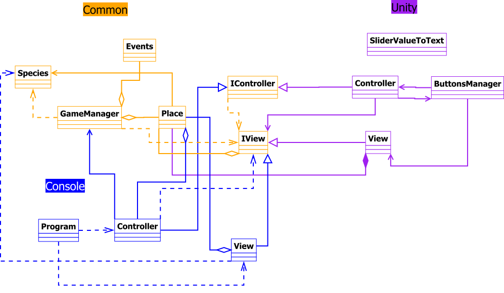

# Projeto de Recurso de LPII 2020/2021

## Autores

* [Diana Nóia](https://github.com/diananoia), a21703004
* [Diogo Maia](https://github.com/Diogo-Maia), a21901308
* [Inês Gonçalves](https://github.com/ineesgoncalvees), a21702076

## Repartição de Tarefas

* Diana Nóia
  * Reprodução das células
  * Seleção das células
  * UI do Unity
  * Comentários XML

* Diogo Maia
  * Swap das células
  * Vizinhança de Von Neumann
  * Shuffle de FisherYates
  * Poisson
  * 

* Inês Gonçalves
  * Setup do repositório git
  * Ajudou a fazer a reprodução das células
  * Ajudou a fazer a seleção das células
  * UI do Unity
  * Relatório
  * Doxigen

## Repositório

O projeto pode ser encontrado neste [repositório](https://github.com/Diogo-Maia/LP2_RockPaperScissor).

## Arquitetura da solução

### Diagrama UML

O UML deste projeto é o seguinte:

## Referências

A [API do C#](https://docs.microsoft.com/en-us/dotnet/csharp/).

